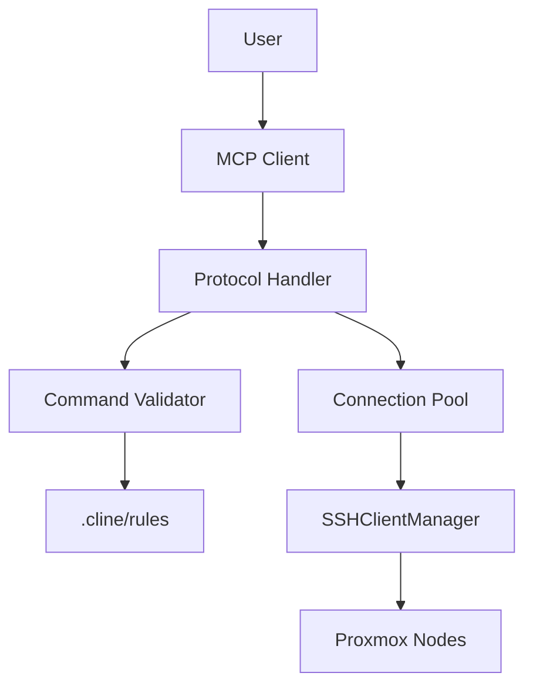
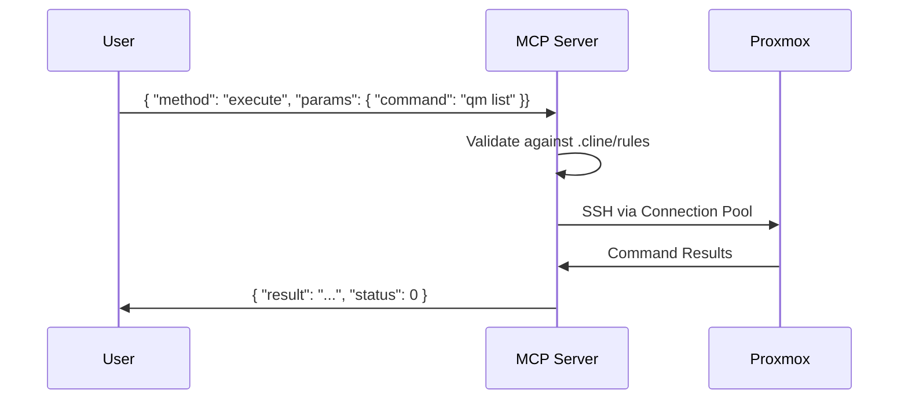

# SSH MCP Server Architecture

## Overview


## Security Model
### Command Whitelist Patterns
```regex
^(qm (list|status \d+|start \d+|stop \d+|shutdown \d+|reboot \d+)
|pvesh (get /nodes/\w+/qemu)
|df -h|free -m|uptime$
```

### Validation Rules
1. All commands must match exact patterns
2. Numeric parameters limited to VM IDs (1-9999)
3. Maximum command duration: 300s
4. No root access except via sudo-n

## Protocol Implementation
### Message Flow


## Deployment Configuration
```yaml
# .cline/mcp/ssh.yaml
connection_pool:
  max_connections: 5
  keepalive: 60
  timeout: 300

security:
  command_validation: strict
  log_sanitization: true
```

## Compliance
- Matches ssh-command-validation.mdc Rule #4
- Follows proxmox-ssh.mdc Host Patterns
- Implements Connection Pooling from RFC-ssh-pool-2025