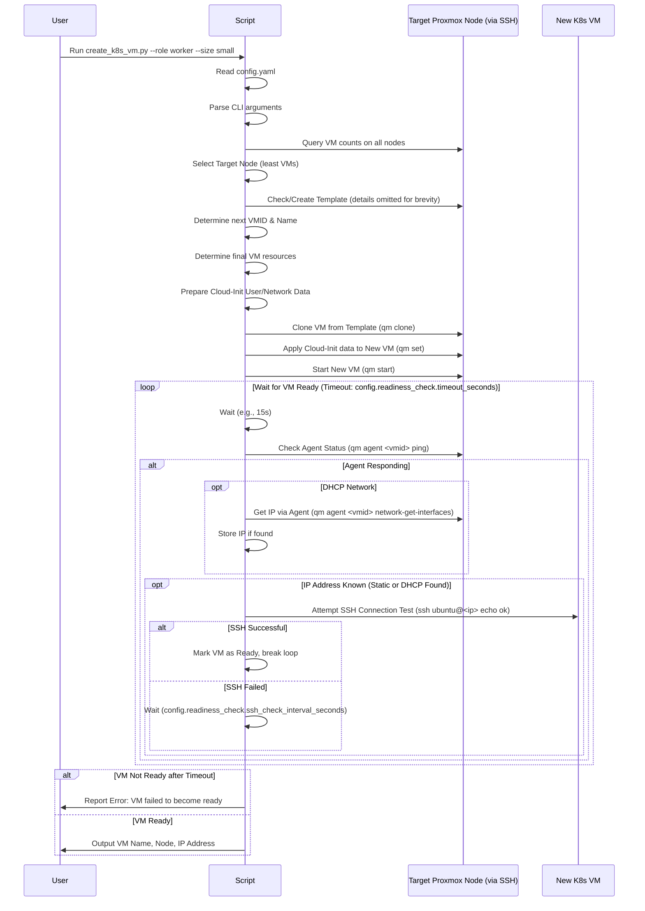

# Proxmox Kubernetes VM Creation Plan

This document outlines the plan for creating Python scripts to automate the provisioning of Kubernetes virtual machines on Proxmox VE.

## Summary of Decisions

**1. Proxmox Environment & Interaction:**

*   **Interaction Method:** Proxmox CLI tools (`qm`, `pvesh`, etc.) executed via SSH.
*   **Authentication:** SSH key-based authentication.
*   **Target Nodes:** `pve1.local`, `pve2.local` (extensible via config file).
*   **SSH User:** `root`.
*   **Storage:** `local-lvm` storage pool on each node for image download, template storage, and VM disks.
*   **Network Bridge:** `vmbr0` (no VLAN tag).

**2. Operating System Image:**

*   **Distribution:** Ubuntu 22.04 LTS Cloud Image.
*   **Source:** `https://cloud-images.ubuntu.com/jammy/current/jammy-server-cloudimg-amd64.img`
*   **Verification:** Perform SHA256 checksum verification after download using the corresponding `SHA256SUMS` file.

**3. VM Template Configuration:**

*   **Base:** Created from the verified Ubuntu 22.04 cloud image.
*   **SSH Access (Clones):** Use Cloud-Init to inject a specified public SSH key (from config file) into the `ubuntu` user's `authorized_keys` on first boot of cloned VMs.
*   **Guest Agent:** `qemu-guest-agent` will be installed in the template using Cloud-Init during template creation.
*   **Default Resources:** 1 vCPU, 2048 MB RAM, 16 GB Disk.
*   **Template Name/ID:** Defined in the configuration file (e.g., `ubuntu-2204-cloud-template`, ID `9000`).

**4. VM Creation & Configuration:**

*   **Node Placement:** Balance VM creation across target nodes based on the current VM count on each node.
*   **Resource Allocation:** Offer predefined sizes ('small', 'medium', 'large' defined in config) via `--size` argument, with command-line overrides (`--cpus`, `--memory`, `--disk`).
    *   **Small:** 1 vCPU, 2GB RAM, 20GB Disk
    *   **Medium:** 2 vCPU, 4GB RAM, 40GB Disk
    *   **Large:** 4 vCPU, 8GB RAM, 80GB Disk
*   **Cloning Method:** Full clones.
*   **IP Assignment:** User chooses between DHCP (`--network dhcp`) or Static IP (`--network static`) via command-line argument.
    *   **Static Config:** Provided via command-line arguments (`--ip`, `--gateway`, `--dns`).
*   **VM Naming:** Based on role (`--role master|worker`) and an auto-incrementing number (e.g., `k8s-master-1`, `k8s-worker-2`). The script will determine the next available number for the specified role.
*   **VMID Selection:** Auto-select next available VMID unless specified via `--vmid`.
*   **Readiness Check:** After starting the VM, the script will wait (with timeout) for the `qemu-guest-agent` to respond, retrieve the IP if using DHCP, and confirm SSH accessibility.

**5. Scripting Approach:**

*   **Language:** Python.
*   **Configuration:** Persistent settings (node list, SSH user/key path, public key, template details, sizes) stored in a YAML configuration file (e.g., `config.yaml`).
*   **Arguments:** Runtime settings (role, size, overrides, IP config, target VMID) provided via command-line arguments using `argparse`.
*   **Libraries:** `argparse`, `yaml`, `paramiko` (or similar for SSH), `logging`.

## Proposed Configuration File (`config.yaml`)

```yaml
proxmox_nodes:
  - pve-pc-mini.icosahedron.org
  - pve-mac-mini.icosahedron.org
ssh_user: root
ssh_private_key_path: ~/.ssh/pve.key  # Example path - Ensure this key allows passwordless root login to nodes
vm_template:
  name: ubuntu-2204-cloud-template
  id: 9000  # Ensure this VMID is reserved/unused initially
  image_url: https://cloud-images.ubuntu.com/jammy/current/jammy-server-cloudimg-amd64.img
  checksum_url: https://cloud-images.ubuntu.com/jammy/current/SHA256SUMS
  storage_pool: local-lvm
  network_bridge: vmbr0
  base_cpus: 1
  base_memory_mb: 2048
  base_disk_gb: 16
cloud_init:
  ssh_public_key: "ssh-rsa AAAAB3NzaC1yc2EAAAADAQABAAABgQ..." # Replace with your actual public SSH key content
vm_sizes:
  small:
    cpus: 1
    memory_mb: 2048
    disk_gb: 20
  medium:
    cpus: 2
    memory_mb: 4096
    disk_gb: 40
  large:
    cpus: 4
    memory_mb: 8192
    disk_gb: 80
readiness_check:
  timeout_seconds: 300 # Timeout for waiting for VM readiness
  ssh_check_interval_seconds: 10 # How often to check SSH after agent is up
```

## Core Logic Flow



This plan provides a comprehensive guide for the implementation phase.